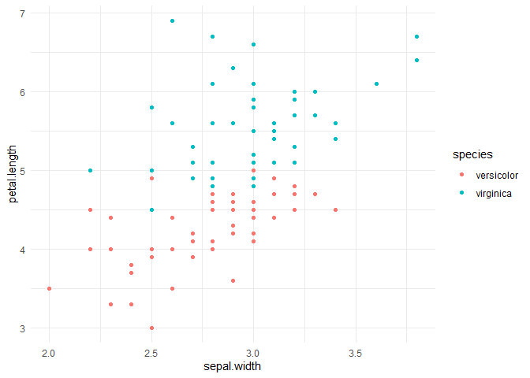

An alternative option (or in addition) to having separate code files for each part of the analysis, a single well documented RMarkdown file can be used. 

When using RMarkdown with GitHub, if we add the option to the YAML header `keep_md: true`, then we can view the rendered document on GitHub.


```r
library(dplyr)
```

```
  Warning: package 'dplyr' was built under R version 4.0.5
```

```
  
  Attaching package: 'dplyr'
```

```
  The following objects are masked from 'package:stats':
  
      filter, lag
```

```
  The following objects are masked from 'package:base':
  
      intersect, setdiff, setequal, union
```

```r
library(ggplot2)
```

```
  Warning: package 'ggplot2' was built under R version 4.0.5
```

```r
library(broom)
```

# Data manipulation

I like using the **dplyr** package from the [tidyverse](https://www.tidyverse.org/) ecosystem. 


```r
data("iris")

iris_sub <- iris %>%
  rename_all(tolower) %>%
  dplyr::filter(species != "setosa", sepal.length > 2)
```

# Summary statistics

You can also embed plots, for example:


```r
summary_table <- iris_sub %>%
  group_by(species) %>%
  summarize(N = n(),
            mean_slen = mean(sepal.length),
            median_slen = median(sepal.length),
            sd_slen = sd(sepal.length))
```

# Exploratory plots

**ggplot2** is another package that is part of the [tidyverse](https://www.tidyverse.org/) ecosystem that can generate nice plots.


```r
ggplot(aes(sepal.width, petal.length, color = species), data = iris_sub) + 
  geom_point() + 
  theme_minimal()
```

<!-- -->

# Fit a linear model

We can regress petal length against sepal width and length to estimate the relationship between these variables.


```r
lm1 <- lm(petal.length ~ sepal.width + sepal.length, data = iris_sub)
```

The **broom*** package has functions such as `tidy` and `glance` that nicely organize the output from many commonly used R packages.


```r
tidy(lm1)
```

```
  # A tibble: 3 x 5
    term         estimate std.error statistic  p.value
    <chr>           <dbl>     <dbl>     <dbl>    <dbl>
  1 (Intercept)    -1.80     0.481      -3.75 3.05e- 4
  2 sepal.width     0.218    0.168       1.30 1.97e- 1
  3 sepal.length    0.971    0.0843     11.5  7.43e-20
```

```r
glance(lm1)
```

```
  # A tibble: 1 x 12
    r.squared adj.r.squared sigma statistic  p.value    df logLik   AIC   BIC
        <dbl>         <dbl> <dbl>     <dbl>    <dbl> <dbl>  <dbl> <dbl> <dbl>
  1     0.692         0.685 0.463      109. 1.63e-25     2  -63.4  135.  145.
  # ... with 3 more variables: deviance <dbl>, df.residual <int>, nobs <int>
```

