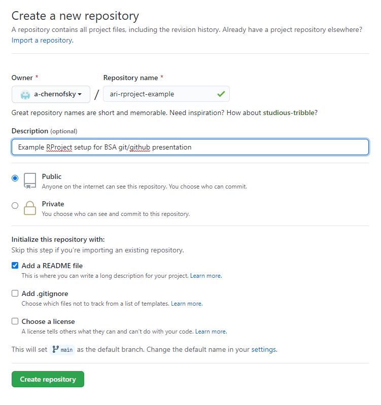
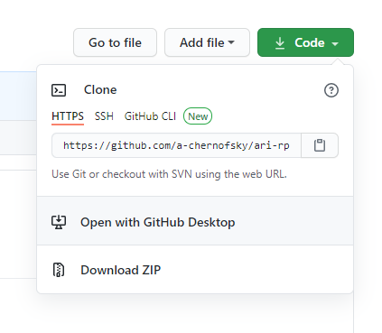
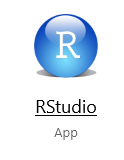
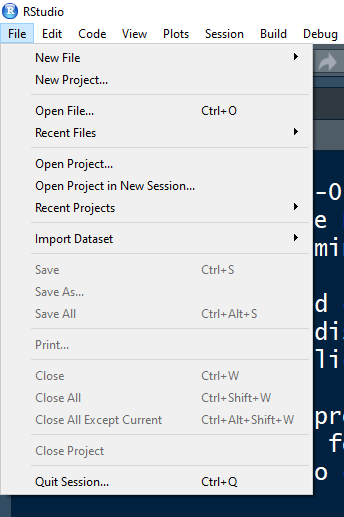
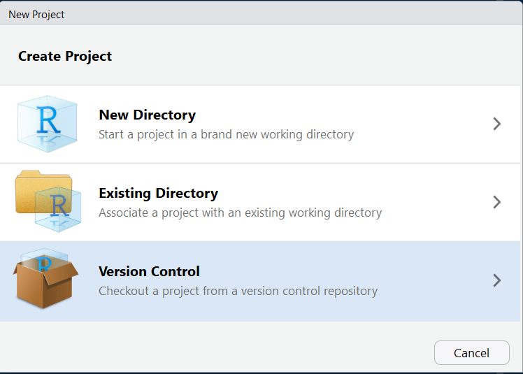
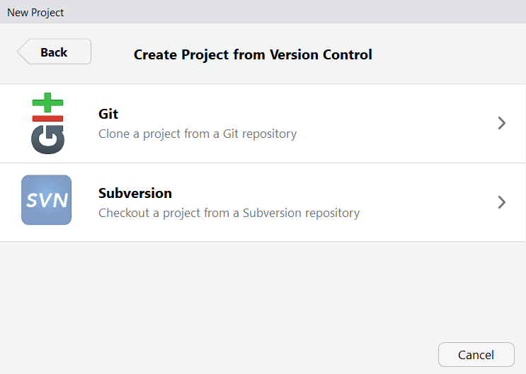

```{r setup, include=FALSE}
knitr::opts_chunk$set(echo = FALSE, fig.align = "center")
```

## Prerequisites

This talk is a hands on tutorial. Hopefully you have:

1. R \& RStudio installed
2. Git installed
3. GitHub account
4. a desire to end versioning files with "_v1", "_v2",...

## Why?

<center>


</center>

## Why?

Git:

- version control
- tracks \& manages evolution of project
- collaboration (won't be covered today:/)

Github

- remote home for git based projects 
- sharing is caring
- view development code
- publicize your accomplishments
    

## Git vs. Github

{width=75%}

## Intro to RProjects

RProject is a receptacle for a complete analysis:

- replicable and/or reproducible
- self contained unit
- forget setting your working directory!
    + relative paths
- easy to integrate with git and GitHub

[organizing RProjects](https://www.r-bloggers.com/2018/08/structuring-r-projects/)

## Tutorial

```{r, out.width = "500px"}

```

## Overview of tutorial

1. make a repo on GitHub
2. new RProject with `git clone`
3. work locally
4. `git add` changes 
5. `git commit` changes 
6. `git push` to GitHub
7. check GitHub for changes
8. make changes on GitHub
9. `git pull` changes to local 

## Glossary | [<font size="2"> A full glossary can be found here</font>](https://docs.github.com/en/free-pro-team@latest/github/getting-started-with-github/github-glossary)
-  `repo`: <font size="3">the most basic element of GitHub. They're easiest to imagine as a project's folder. A repository contains all of the project files (including documentation), and stores each file's revision history. Repositories can have multiple collaborators and can be either public or private.</font>
-  `clone`: <font size="3">a copy of a repository that lives on your computer instead of on a website's server somewhere, or the act of making that copy.</font> 
-  `add`: <font size="3">updates the index using the current content found in the working tree, to prepare the content staged for the next commit.</font>
-  `commit`: <font size="3"> or "revision", is an individual change to a file (or set of files). When you make a commit to save your work, Git creates a unique ID (a.k.a. the "SHA" or "hash") that allows you to keep record of the specific changes commited along with who made them and when. Commits usually contain a commit message which is a brief description of what changes were made.</font>
-  `push`: <font size="3">To push means to send your committed changes to a remote repository on GitHub.com. For instance, if you change something locally, you can push those changes so that others may access them.</font>


## Glossary | [<font size="2"> A full glossary can be found here</font>](https://docs.github.com/en/free-pro-team@latest/github/getting-started-with-github/github-glossary)

-  `pull`: <font size="3">Pull refers to when you are fetching in changes and merging them. For instance, if someone has edited the remote file you're both working on, you'll want to pull in those changes to your local copy so that it's up to date.</font>
-  `pull request` : <font size="3"> Pull requests are proposed changes to a repository submitted by a user and accepted or rejected by a repository's collaborators. Like issues, pull requests each have their own discussion forum.</font>
-  `remote` : <font size="3"> This is the version of a repository or branch that is hosted on a server, most likely GitHub.com. Remote versions can be connected to local clones so that changes can be synced.</font>
-  `branch` : <font size="3"> A branch is a parallel version of a repository. It is contained within the repository, but does not affect the primary or master branch allowing you to work freely without disrupting the "live" version. When you've made the changes you want to make, you can merge your branch back into the master branch to publish your changes.</font>


## Glossary | [<font size="2"> A full glossary can be found here</font>](https://docs.github.com/en/free-pro-team@latest/github/getting-started-with-github/github-glossary)

-  `diff` : <font size="3"> A diff is the difference in changes between two commits, or saved changes. The diff will visually describe what was added or removed from a file since its last commit.</font>
-  `Git` : <font size="3"> Git is an open source program for tracking changes in text files. It was written by the author of the Linux operating system, and is the core technology that GitHub, the social and user interface, is built on top of.</font>
-  `Markdown` : <font size="3"> Markdown is an incredibly simple semantic file format, not too dissimilar from .doc, .rtf and .txt. Markdown makes it easy for even those without a web-publishing background to write prose (including with links, lists, bullets, etc.) and have it displayed like a website. GitHub supports Markdown and uses a particular form of Markdown called GitHub Flavored Markdown. See GitHub Flavored Markdown Spec or Getting started with writing and formatting on GitHub.</font>
-  `README` : <font size="3"> A file containing information about the files in a repository that is typically the first file a visitor to your repository will see. A README file, along with a repository license, contribution guidelines, and a code of conduct, helps you share expectations and manage contributions to your project.</font>

## Glossary | [<font size="2"> A full glossary can be found here</font>](https://docs.github.com/en/free-pro-team@latest/github/getting-started-with-github/github-glossary)
-  `issue` : <font size="3"> Issues are suggested improvements, tasks or questions related to the repository. Issues can be created by anyone (for public repositories), and are moderated by repository collaborators. Each issue contains its own discussion thread. You can also categorize an issue with labels and assign it to someone.</font>

## Step 1

Click on "New" to create a new repository

<center>


</center>

## Step 2

Fill out the necessary information:

```{r, out.width = "400px"}

```

Click "Create Repository"

## Step 3

Copy to clipboard

```{r, out.width = "300px"}

```

## Step 4

Open RStudio

```{r, out.width = "200px"}

```


## Step 5

File > New Project...

```{r, out.width = "300px"}

```


## Step 6

Choose "Version Control"

```{r, out.width = "500px"}

```

## Step 7

Choose "Git"

```{r, out.width = "500px"}

```

Copy https into window and create project

## Resources

Jenny Bryan from RStudio developed an amazing bookdown for Git and GitHub for R users:


[Happy Git and GitHub for the useR](https://happygitwithr.com/)
